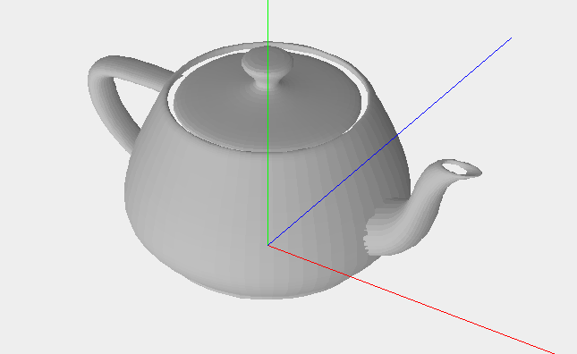
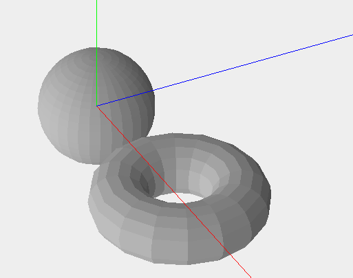
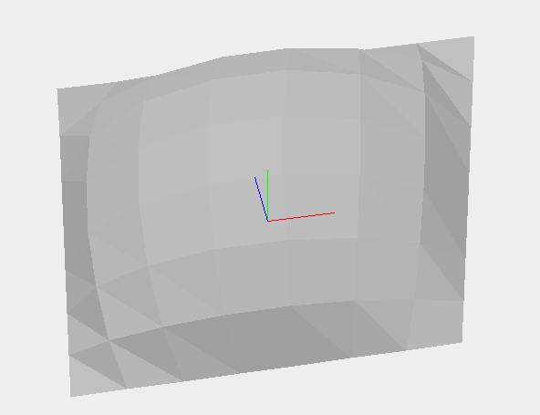
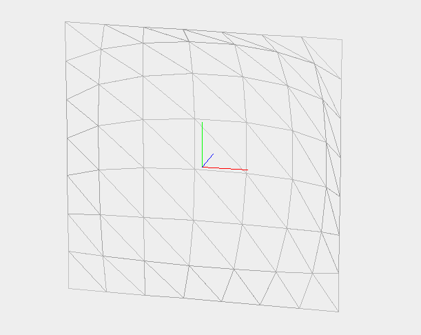

# e3d

3D engine (including renderer and viewer)

## Support

[open an issue here](https://gitlab.com/arno750/e3d/-/issues).

## Authors & contributors

Original setup of this repository by [Arnaud WIELAND](https://gitlab.com/arno750).

## License

Every details about licence are in a [separate document](LICENSE).

## About the project

This implementation is freely based on the book: Watt A. (1993) _3D Computer Graphics_ (second edition). Addison-Wesley.

It was realized in december 2011 for self educational purpose.

In december 2022 the project has been reviewed, fixed and documented.

## Rendering examples

### The Utah teapot

### A sphere and a torus

### A Bezier patch

## Affine transformations

The points are defined using homogeneous coordinates $\left[\begin{array}{ccc}x & y & z & w\end{array}\right]$ with $w$ always taken to be 1.

$\begin{bmatrix}
   a & b \\
   c & d
\end{bmatrix}$

The three most commonly used transformations (translation, scaling and rotation) are treated in the same way with 4x4 matrices.

Translation defined by $\left[\begin{array}{ccc}T_x & T_y & T_z\end{array}\right]$:

$T =\left[\begin{array}{ccc}
1 & 0 & 0 & 0\\
0 & 1 & 0 & 0\\
0 & 0 & 1 & 0\\
T_x & T_y & T_z & 1
\end{array}\right]$

Scaling defined by $\left[\begin{array}{ccc}S_x & S_y & S_z\end{array}\right]$:

$S =\left[\begin{array}{ccc}
S_x & 0 & 0 & 0\\
0 & S_y & 0 & 0\\
0 & 0 & S_z & 0\\
0 & 0 & 0 & 1
\end{array}\right]$

Rotation (counterclockwise) about the _X_, _Y_ and _Z_ axis respectively defined by the $\theta$ angle:

$R_x =\left[\begin{array}{ccc}
1 & 0 & 0 & 0\\
0 & \cos \theta & \sin \theta & 0\\
0 & -\sin \theta & \cos \theta & 0\\
0 & 0 & 0 & 1
\end{array}\right]$

$R_y =\left[\begin{array}{ccc}
\cos \theta & 0 & -\sin \theta & 0\\
0 & 1 & 0 & 0\\
\sin \theta & 0 & \cos \theta & 0\\
0 & 0 & 0 & 1
\end{array}\right]$

$R_z =\left[\begin{array}{ccc}
\cos \theta & \sin \theta & 0 & 0\\
-\sin \theta & \cos \theta & 0 & 0\\
0 & 0 & 1 & 0\\
0 & 0 & 0 & 1
\end{array}\right]$
