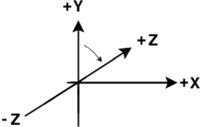

# e3d

[](https://gitlab.com/arno750/e3d/-/commits/main)

3D engine (including renderer and viewer)

## Support

[open an issue here](https://gitlab.com/arno750/e3d/-/issues).

## Authors & contributors

Original setup of this repository by [Arnaud WIELAND](https://gitlab.com/arno750).

## License

Every details about licence are in a [separate document](LICENSE).

## About the project

This implementation is freely based on the book: Watt A. (1993) _3D Computer Graphics_ (second edition). Addison-Wesley.

It was realized in december 2011 for self educational purpose.

In december 2022 the project has been reviewed, fixed and documented.

## Rendering examples

### The Utah teapot


### A sphere and a torus


### A Bezier patch


## Affine transformations

The points are defined using homogeneous coordinates $[x y z w]$ with $w$ always taken to be 1.

The three most commonly used transformations (translation, scaling and rotation) are treated in the same way with 4x4 matrices.

Translation defined by $[T_x T_y T_z]$:

```math
T =\begin{bmatrix}
1 & 0 & 0 & 0\\
0 & 1 & 0 & 0\\
0 & 0 & 1 & 0\\
T_x & T_y & T_z & 1
\end{bmatrix}
```

Scaling defined by $[S_x S_y S_z]$:

```math
S =\begin{bmatrix}
S_x & 0 & 0 & 0\\
0 & S_y & 0 & 0\\
0 & 0 & S_z & 0\\
0 & 0 & 0 & 1
\end{bmatrix}
```

Rotation (counterclockwise) about the _X_, _Y_ and _Z_ axes respectively defined by the $\theta$ angle:

```math
R_x =\begin{bmatrix}
1 & 0 & 0 & 0\\
0 & \cos \theta & \sin \theta & 0\\
0 & -\sin \theta & \cos \theta & 0\\
0 & 0 & 0 & 1
\end{bmatrix}
```

```math
R_y =\begin{bmatrix}
\cos \theta & 0 & -\sin \theta & 0\\
0 & 1 & 0 & 0\\
\sin \theta & 0 & \cos \theta & 0\\
0 & 0 & 0 & 1
\end{bmatrix}
```

```math
R_z =\begin{bmatrix}
\cos \theta & \sin \theta & 0 & 0\\
-\sin \theta & \cos \theta & 0 & 0\\
0 & 0 & 1 & 0\\
0 & 0 & 0 & 1
\end{bmatrix}
```

## Coordinate systems

The coordinate system is left-handed: the positive x, y and z axes point right, up and forward, respectively.


Positive rotation is clockwise about the axes of rotation and is using Tait–Bryan angles:

|        Angle         | Letter |     Range     |  Axis  |
| :------------------: | :----: | :-----------: | :----: |
| Pitch (or elevation) |   β    |  [-90°, 90°]  | x-axis |
|   Yaw (or heading)   |   α    |  [0°, 360°]   | y-axis |
|    Roll (or bank)    |   γ    | [-180°, 180°] | z-axis |

Pitch is the angle that the camera (the longitudinal z-axis) forms with the horizon. If the camera is pointed at the horizon, the pitch is 0° ; if it is pointed straight up, the pitch is 90° ; and if it is pointed straight down, the pitch is -90°.



Heading (yaw angle) is the horizontal direction that the camera is pointing, measured clockwise from true north.


Roll angle is the amount of rotation around the longitudinal z-axis in order to bring the lateral x-axis parallel with the horizon, with the top side facing above rather than below the horizon.


To relate the camera-fixed coordinate system to the scene-fixed coordinate system the axes start in the same orientation and are first rotated by α about the y-axis. The second rotation is about the x-axis by β. Finally, the third rotation is by γ about the z-axis

See:

- [Axes conventions](https://en.wikipedia.org/wiki/Axes_conventions)
- [Euler angles](https://en.wikipedia.org/wiki/Euler_angles)
- [Right-hand rules](https://en.wikipedia.org/wiki/Right-hand_rule)
